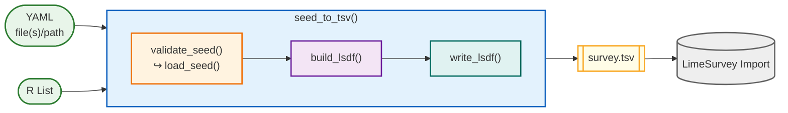

# LimeSeed

**Author your [LimeSurvey](https://www.limesurvey.org) questionnaires in YAML — export to TSV in one call.**

LimeSeed is an R package that allows you to define surveys as human-readable YAML files and compile them into TSV format for import into [LimeSurvey](https://www.limesurvey.org).

Avoid tedious and error-prone manual clicking through the web interface. Edit your survey in your preferred coding environment, collaborate with colleagues, and share and publish it seamlessly.

--- 

## Core Concept

At the heart of LimeSeed is the **seed** — a structured survey definition that fully describes your questionnaire in a simple and clean format.

A seed can come in multiple forms:

- **single YAML file** → with settings, structure, optional quota
- **multiple YAML files** → for settings, structure, optional quota
- **R list** → create manually or programmatically

Every seed input is normalized into a consistent internal structure that can be modfied, validated, and reused.

YAML is used as the primary format because it combines **readability** with **structure**. It is concise and easy to review, yet expressive enough to represent complex survey logic. At the same time, it integrates naturally with R, allowing a smooth transition between static files and programmatic workflows.

This makes the seed a powerful abstraction:

- **Readable** → clear, concise, and easy to maintain
- **Flexible** → works both as static files and dynamic R objects
- **Portable** → independent of the LimeSurvey interface
- **Reproducible** → version-control friendly and deterministic

Because the seed is just data, you can:

- adjust survey logic or content dynamically
- reuse and combine survey components
- generate multiple survey variants
- integrate survey generation into data pipelines

---

## Pipeline

LimeSeed follows a simple, three-stage pipeline for turning survey definitions into LimeSurvey import files:

1. **Load & Validate** – validate_seed() checks and normalizes the seed (internally using load_seed() to support multiple input formats such as YAML files, folders, or R lists).
2. **Build** – build_lsdf() compiles the validated seed into a structured data frame.
3. **Write** – write_lsdf() exports the data frame as a TSV file ready for import.

The convenience wrapper **seed_to_tsv()** runs this full pipeline in a single call.
For more control, each stage can also be used independently to inspect, modify, or debug the survey before export.



---

## Installation

```r
# Install from GitHub
devtools::install_github("https://github.com/StefanMunnes/LimeSeed")

library(LimeSeed)
```

## Quick Start

### One-liner — YAML seed file directly to TSV

```r
seed_to_tsv("my_survey.yaml", "output/my_survey.tsv")
```

### Step-by-step — modify before exporting

```r
# Stage 1 — load and normalise
seed <- load_seed("my_survey.yaml")

# Stage 2 — manipulate
seed$settings$anonymized <- "N"
seed$structure$Demographics$Age$mandatory <- "Y"

# Stage 3 — compile and export
seed_to_tsv(seed, "output/my_survey.tsv")
```

### Programmatic seed — no YAML file needed

A seed can also be defined as a nested R list instead of a YAML file. This can be an easy way for quick testing or simple surveys. One could also use functions to fill the seed.

```r
seed <- list(
  settings = list(
    language = "en",
    titles   = "My Programmatic Survey"
  ),
  structure = list(
    G1 = list(
      Q1 = list(
        type          = "radio",
        questionTexts = "What is your favorite letter?"
        answerOptions = letters[1:10]
      )
    )
  )
)

seed_to_tsv(seed, "output/my_survey.tsv")
```

---

## Seed - YAML Format

A single YAML file as seed has up to three top-level keys:

```yaml
settings:   # Survey-level settings (required)
structure:  # Groups → questions (required)
quota:      # Quota definitions (optional)
```

When working with larger surveys create distinct `settings.yml`, `structure.yml`, and `quota.yml` files and point a folder path at them as seed input.

### Minimal example

```yaml
settings:
  language: 'en'
  titles: 'Customer Satisfaction Survey'

structure:
  Demographics:
    Age:
      type: 'numerical input'
      questionTexts: 'How old are you?'
      mandatory: 'Y'
      min_num_value_n: 18
      max_num_value_n: 99

    Gender:
      type: 'radio'
      questionTexts: 'How do you identify?'
      answerOptions:
        'M': 'Male'
        'F': 'Female'
        'D': 'Diverse'
        'N': 'Prefer not to say'

  Satisfaction:
    OverallRating:
      type: 'array'
      questionTexts: 'Rate the following aspects:'
      subquestions:
        'SQ1': 'Product quality'
        'SQ2': 'Customer service'
        'SQ3': 'Value for money'
      answerOptions:
        1: 'Very poor'
        2: 'Poor'
        3: 'Neutral'
        4: 'Good'
        5: 'Excellent'

    Comments:
      type: 'long text'
      questionTexts: 'Any further comments?'
      relevance: "OverallRating_SQ1 != 5"
```

### Multi-language example

```yaml
settings:
  language: 'en'
  additional_languages: 'de'
  titles:
    en: 'Customer Survey'
    de: 'Kundenbefragung'
  welcomeTexts:
    en: 'Thank you for your participation!'
    de: 'Vielen Dank für Ihre Teilnahme!'

structure:
  G1:
    Q1:
      type: 'radio'
      questionTexts:
        en: 'What is your age group?'
        de: 'Welcher Altersgruppe gehören Sie an?'
      answerOptions:
        A1:
          optionTexts:
            en: 'Under 25'
            de: 'Unter 25'
        A2:
          optionTexts:
            en: '25–44'
            de: '25–44'
        A3:
          optionTexts:
            en: '45 and over'
            de: '45 und älter'
```

### Quota Definitions

Quotas are defined as a top-level `quota:` key in your YAML or seed.

```yaml
quota:
 quota_female:
   limit: 150
   members:
     Gender: 'F'
   action: 1
   active: 1
   messageTexts:
     en: 'Thank you — we have reached our quota for this group.'
     de: 'Vielen Dank — wir haben unser Kontingent für diese Gruppe erreicht.'
   urls:
     en: 'https://example.com/closed'
     de: 'https://example.com/geschlossen'
```
